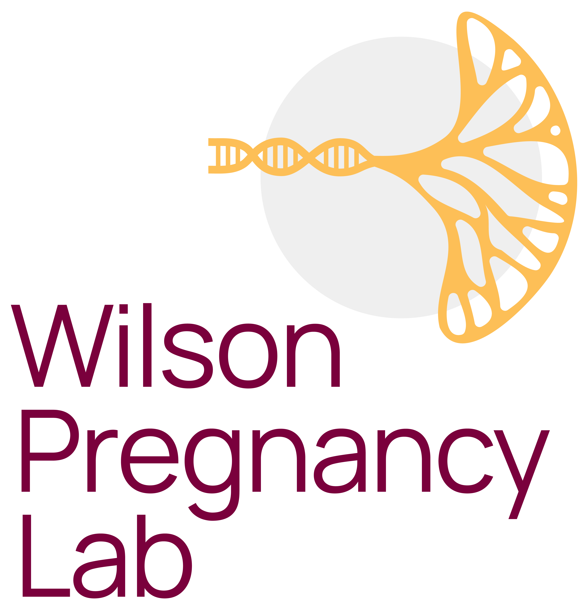

**Wilson Pregnancy Lab News Archive**

*2022-09-19.* New students, Ahmed Berih, Mehroop Randhawa, and Nataie Yuen join the lab.

*2022-09-19.* The "Sensitive and reproducible cell-free methylome quantification with synthetic spike-in controls" publication is now available online at [Cell Reports Methods](https://www.cell.com/cell-reports-methods/fulltext/S2667-2375(22)00176-X#supplementaryMaterial)

*2022-08-19.* The Wilson Pregnancy Lab has received funding from the Preeclampsia Foundation Vision Grant for the study "Non-invasively assessing placental aging and oxidative stress as markers for preeclampsia".
The press release for the grant can be found [here.](https://www.preeclampsia.org/the-news/news-from-the-foundation/2022-preeclampsia-foundation-vision-grant-awardees-announced)

*2022-07-01.* The Wilson lab has officially opened at McMaster Univesrity in the Department of Obstetrics and Gynecology. To kick off the lab, the official Wilson Pregnancy Lab logo is here!