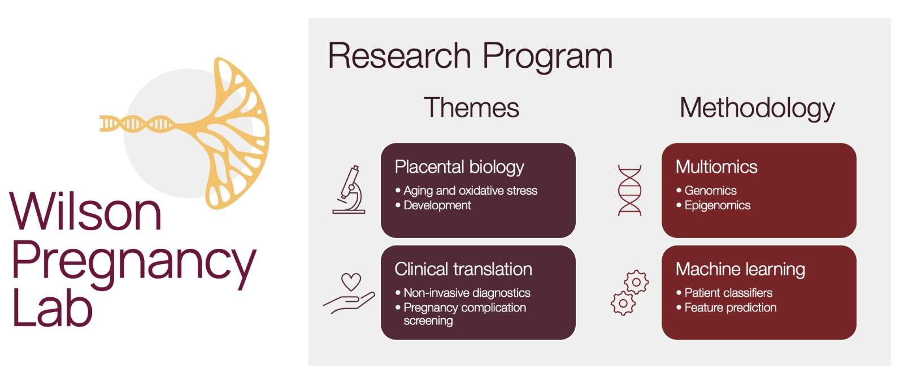

---
title:
summary:
date:

reading_time: false  # Show estimated reading time?
share: false  # Show social sharing links?
profile: false  # Show author profile?
comments: false  # Show comments?

# Optional header image (relative to `assets/media/` folder).
header:
  caption: ""
  image: ""
---

**Research Program Overview**

The Wilson Pregnancy Lab at McMaster University focuses on understanding placental development through the analysis of multi-omics data. The lab consists of both basic science and translational research branches, each addressing different aspects of placental biology and pregnancy complications.

**Basic Science Theme:**

*Placental Aging and Oxidative Stress* 

Investigating epigenetic aging, mitochondrial function, and molecular changes associated with cellular stress in the placenta.

*Placental Development* 

Characterizing molecular characteristics in early placental and fetal development, studying genomic and epigenomic variability in normal placental development, and assessing the impact of environmental exposures (such as smoking, oxygen changes, and trophoblast disruption) on placental development.

**Translational Theme**

*Pregnancy Complications*

Investigating the causes of various pregnancy complications, including idiopathic preterm birth, preeclampsia, intrauterine growth restriction, chorioamnionitis, and placental abruption.

*Molecular Profiling*

Utilizing molecular profiles to identify novel subtypes of pregnancy complications.

*Non-invasive Assessment*

Developing novel methods to non-invasively assess placental and pregnancy health.

*Machine Learning and Predictive Models*

Applying machine learning approaches to develop classification and predictive models based on the collected data.

**Methodologies Used**

The Wilson Pregnancy Lab employs a range of advanced methodologies to investigate placental development and pregnancy complications. These include:

*Whole Genome Sequencing*: Examining the complete DNA sequences of the placental genome to identify genetic variations and mutations.

*cfMeDIP-seq*: Employing this method to study DNA methylation patterns, which play a crucial role in gene regulation.

*EM-seq*: Utilizing this technique to investigate epigenetic modifications and chromatin accessibility patterns.

*RNA-seq*: Analyzing the transcriptome of placental cells to understand gene expression profiles and identify differentially expressed genes.

*Microarray Data*: Utilizing microarrays to study gene expression and DNA methylation to identify molecular changes in placental and blood samples.

*Coding Languages*
Students are allowed the opprotunity to explore different coding languages to tackle their experimental questions.
However, the Wilson Pregnancy Lab primarily uses R, bash, and python.

*Model Systems*

a.Human samples: Using real biological human samples to investigate placental development and the molecular underpinnings of placental dysfunction.

b. Mouse Models: Using mouse models to investigate underlying mechanisms of placental development.

c. Organ-on-a-Chip Models: Employing organ-on-a-chip models to mimic placental tissue and study its functions in a controlled environment.

d. Cell Culture: Conducting experiments using placental cell cultures to investigate cellular processes and responses.

