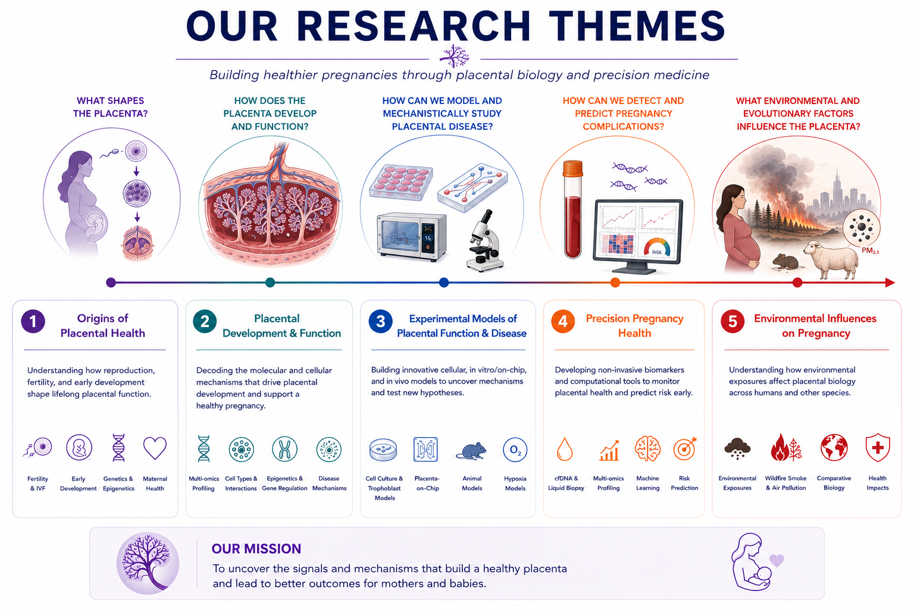

---
title:
summary:
date:

reading_time: false  # Show estimated reading time?
share: false  # Show social sharing links?
profile: false  # Show author profile?
comments: false  # Show comments?

# Optional header image (relative to `assets/media/` folder).
header:
  caption: ""
  image: ""
---

**Research Program Overview.**
The Wilson Pregnancy Lab at McMaster University is dedicated to understanding the biology of the placenta to improve pregnancy health. Our research integrates molecular biology, multi-omics, computational biology, and experimental models to investigate how the placenta develops, functions, and responds to reproductive, genetic, and environmental influences. Together, these studies aim to improve the prediction, prevention, and treatment of pregnancy complications through five interconnected research themes.

*Origins of Placental Health.*
We investigate how fertility, assisted reproduction, genetics, epigenetics, and early embryonic development influence placental formation and establish the foundation for healthy pregnancies.

*Placental Development & Function.*
We study the molecular and cellular mechanisms that regulate placental development throughout pregnancy, with a focus on gene regulation, epigenomics, transcriptomics, cell biology, and placental adaptation in health and disease.

*Experimental Models of Placental Function & Disease.*
We use experimental model systems to investigate the mechanisms underlying placental development and dysfunction. Our work combines trophoblast cell culture, human tissues, animal models, and collaborative experimental platforms to better understand placental biology.

*Precision Pregnancy Health.*
We develop non-invasive approaches to assess placental health throughout pregnancy using cell-free DNA, multi-omics technologies, and computational methods. Our goal is to improve early detection, risk prediction, and biological understanding of pregnancy complications.

*Environmental Influences on Pregnancy.*
We investigate how environmental exposures, including wildfire smoke and air pollution, influence placental biology across mammalian species to better understand how the environment shapes pregnancy health.

**Our Approach.**
Our laboratory combines molecular and computational approaches to study placental biology across multiple scales—from genes and cells to whole pregnancies. We integrate genomic, epigenomic, transcriptomic, and cell-free DNA analyses with bioinformatics, machine learning, and experimental model systems to better understand placental development and pregnancy complications.

